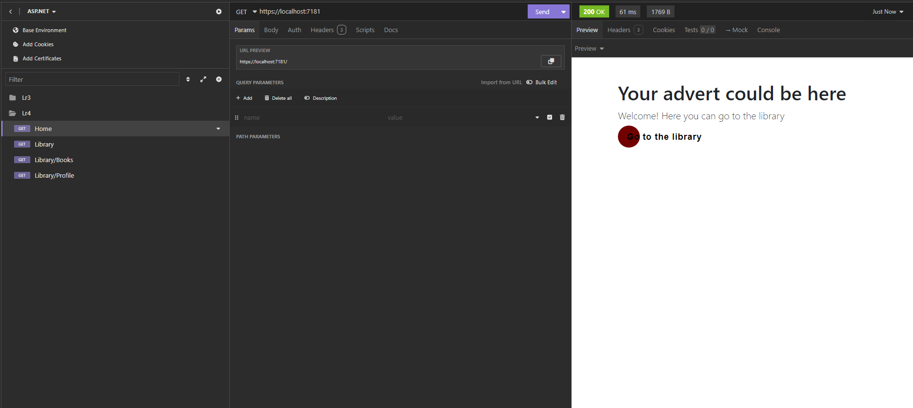
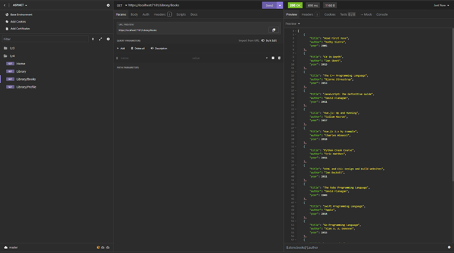
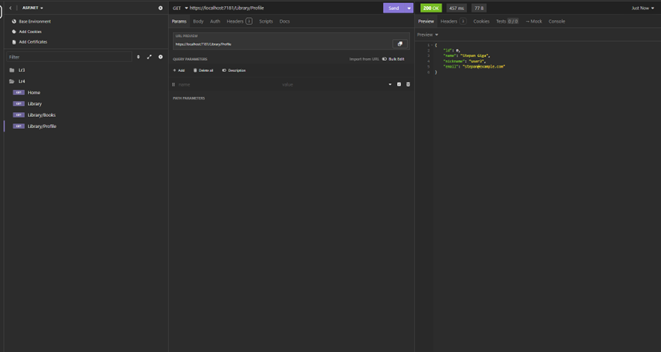
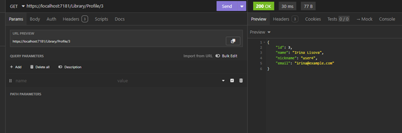

# ЛАБОРАТОРНА РОБОТА №4
## Тема роботи: Маршрутизація в ASP.NET Core.

### **Завдання:**
Задати такі шляхи маршрутизації: Library, Library \ Books, Library \ Profile. Запит, надісланий на адресу Library, повинен повертати текст привітання. Шлях Library\Books повинен виводити список книг, записаний як файл конфігурації будь-якого типу на вибір учня. Шлях Library\Profile повинен приймати як необов'язковий параметр id, де, відповідно до введеного значення (маршрут повинен набувати тільки цілих чисел від 0 до 5) буде в екран браузера виведена інформація про користувача бібліотеки під певним id (інформація повинна бути записана у вигляді файлу конфігурації будь-якого формату). У випадку, якщо користувач не ввів необов'язковий параметр, повинна виводитися інформація про самого користувача.

### **Контрольні питання**
1. Що таке маршрутизація? Навіщо вона потрібна?
2. Яким чином можна задати маршрут в ASP.NET Core базовій програмі?
3. Розкажіть про будову маршруту.
4. Опишіть типи параметрів сегментів маршруту.
5. Що таке обмеження маршруту? Для чого воно необхідне? Які види обмежень ви знаєте?

___
### **
Скріншоти запитів
**
___

Рисунок 1 – Home

Рисунок 2 – Library

Рисунок 3 – Book

Рисунок 4 – User

Рисунок 5 – User + ID

